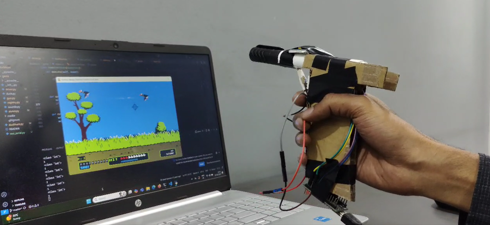

# duckHunt_pc_v1

A motion-controlled version of the classic Duck Hunt game, adapted for laptops using an Arduino Nano, MPU6050 motion sensor, and Python. This project enables physical gun-like gameplay by capturing hand movement and trigger input through custom hardware.


<h2>🎥 <a href="https://www.reddit.com/r/developersIndia/comments/1jjcxyw/i_modified_duck_hunt_game_to_play_with_self_made/" target="_blank">▶️ Watch Gameplay Demo (Click Here)</a></h2>

---

<h2>🖼️ Gameplay Screenshot</h2>

<p align="center">
  
</p>

---

## 🎯 Overview

This is a reimplementation of Duck Hunt using real-world motion control. The user aims and shoots in-game using a handmade controller built from cardboard, an MPU6050 sensor, and a basic Arduino circuit.

## 🔧 Hardware Requirements

- Arduino Nano / Uno
- MPU6050 Accelerometer + Gyroscope
- Push Button (or custom trigger with foil)
- USB cable for serial communication
- Cardboard (for physical housing, optional)

## 🔌 Wiring Diagram

**Connections:**

- MPU6050 → Arduino
  - VCC → 3.3V
  - GND → GND
  - SDA → A4
  - SCL → A5

- Trigger Button
  - One side to Pin 7
  - Other side to GND  
  *(Configured as INPUT_PULLUP)*

## 💻 Software Stack

- Python 3
- pygame – for game rendering
- pyserial – for reading serial data
- Threading – to handle sensor input without blocking game loop


## 🧪 How It Works

- The Arduino reads MPU6050 acceleration data and trigger input.
- Data is sent over serial in the format: xAcc,yAcc,trigger.
- Python reads this in a separate thread, converts it into movement and fire events inside the game.

## 🚀 Getting Started

### 1. Install dependencies

```bash
pip install pygame pyserial
```

### 2. Upload Arduino sketch

Upload `gun_reader.ino` to your Arduino Nano using the Arduino IDE.

### 3. Run the game

```bash
python duckhunt.py
```

Ensure the Arduino is connected to the correct serial port and the port is available.


## 📄 License & Credit

- Original Duck Hunt logic forked ,modified and inspired by [Original Python Duck Hunt Repository](https://github.com/aosyborg/duckhunt)  
- This project is a modified version with added motion control and custom hardware input.

